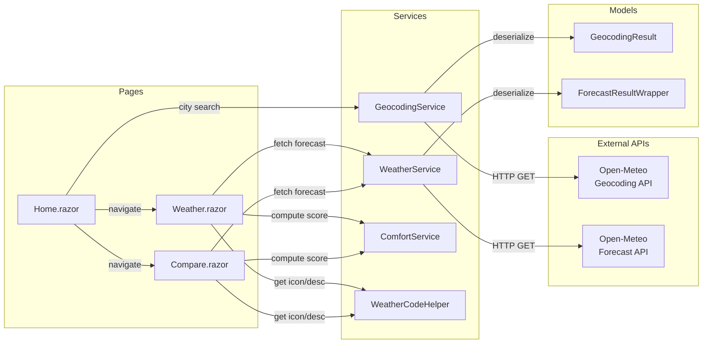
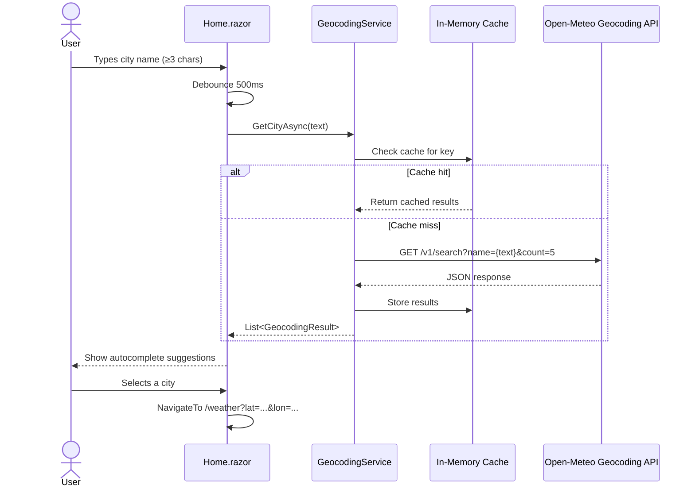
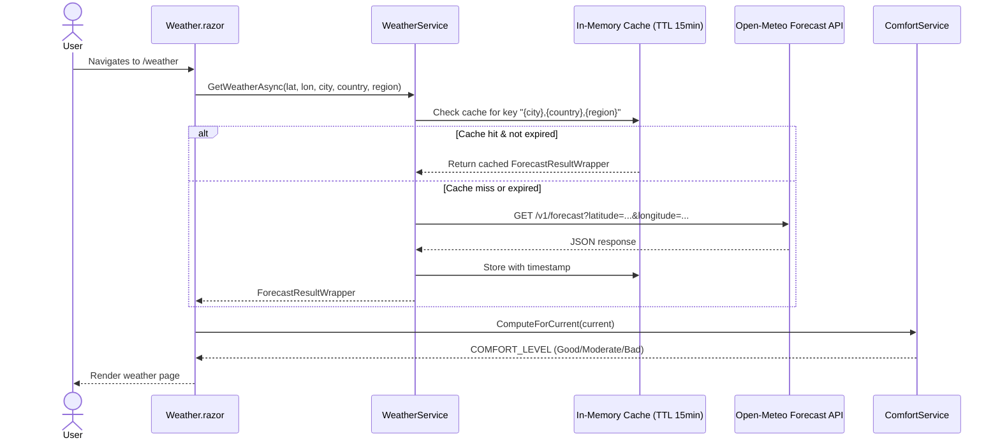

# 🌤️ WeatherInsights
### API Consumer Assignment 2026 - Leuze Engineering

> A Blazor WebAssembly application that retrieves real-time weather data from the [Open-Meteo API](https://open-meteo.com/) and applies custom business logic to evaluate weather comfort.

**🔗 Live Demo:** [christoph1j2.github.io/WeatherInsights](https://christoph1j2.github.io/WeatherInsights)

---

## ✨ Features

- **City Search** - debounced autocomplete with a minimum of 3 characters, powered by the Open-Meteo Geocoding API
- **Current Weather** - temperature, weather description, humidity, wind speed, and last update time
- **3-Day Forecast** - min/max temperatures, weather icons, and comfort scores for the next 3 days
- **Comfort Score** - custom algorithm evaluating temperature, humidity, wind speed, and weather code → **Good / Moderate / Bad**
- **City Comparison** - compare up to 3 cities side by side, with automatic **BEST** city detection
- **In-Memory Caching** - weather results cached with a **15-minute TTL** to reduce API calls
- **Weather Icons** - emoji-based icons mapped to WMO weather codes

---

## 🖥️ Screenshots

| Home | Weather | Compare |
|------|---------|---------|
|  |  |  |

---

## 🏗️ Architecture

### Project Structure

```
WeatherInsights/
├── Models/
│   ├── GeocodingResult.cs       # Geocoding API response model
│   └── ForecastResult.cs        # Weather forecast response models
├── Services/
│   ├── GeocodingService.cs      # City search + geocoding cache
│   ├── WeatherService.cs        # Forecast fetching + TTL cache
│   ├── ComfortService.cs        # Comfort score algorithm
│   └── WeatherCodeHelper.cs     # WMO code → description/icon mapping
├── Pages/
│   ├── Home.razor               # City search + compare mode
│   ├── Weather.razor            # Weather detail page
│   └── Compare.razor            # City comparison page
└── Layout/
    └── MainLayout.razor         # App shell (header, footer)
```

### Component Diagram



---

## 🔄 Sequence Diagrams

### City Search Flow



### Weather Fetch Flow



---

## 🧠 Comfort Score Algorithm

The comfort score is computed by evaluating four factors, each scored 0–2 points:

| Factor | Good (2pts) | Moderate (1pt) | Bad (0pts) |
|--------|-------------|----------------|------------|
| Temperature | 18–25°C | 15–28°C | Outside range |
| Humidity | < 60% | 60–80% | > 80% |
| Wind Speed | < 20 km/h | 20–40 km/h | > 40 km/h |
| Weather Code | 0–2 (clear) | 3–49 (cloudy/fog) | 50+ (rain/snow/storm) |

**Total score → Rating:**
- **6–8 points** → 🟢 Good
- **3–5 points** → 🟡 Moderate  
- **0–2 points** → 🔴 Bad

---

## 🛠️ Tech Stack

| Technology | Purpose |
|------------|---------|
| **Blazor WebAssembly (.NET 10)** | Frontend framework |
| **MudBlazor** | UI component library |
| **Open-Meteo Geocoding API** | City search & coordinates |
| **Open-Meteo Forecast API** | Weather data (free, no API key) |
| **GitHub Actions** | CI/CD deployment |
| **GitHub Pages** | Hosting |

---

## 🚀 How to Run Locally

**Prerequisites:** .NET 10 SDK

```bash
# Clone the repository
git clone https://github.com/christoph1j2/WeatherInsights.git
cd WeatherInsights

# Run with hot reload
dotnet watch

# Or just run
dotnet run
```

Open your browser at `https://localhost:5001` or `http://localhost:5000`.

---

## 🌐 API Reference

### Geocoding API
```
GET https://geocoding-api.open-meteo.com/v1/search?name={city}&count=5
```
Returns up to 5 city matches with coordinates, country, and region.

### Forecast API
```
GET https://api.open-meteo.com/v1/forecast
    ?latitude={lat}
    &longitude={lon}
    &current=temperature_2m,relative_humidity_2m,wind_speed_10m,weather_code
    &daily=temperature_2m_max,temperature_2m_min,weather_code
    &forecast_days=4
```
Returns current weather and 4-day forecast. **No API key required.**
